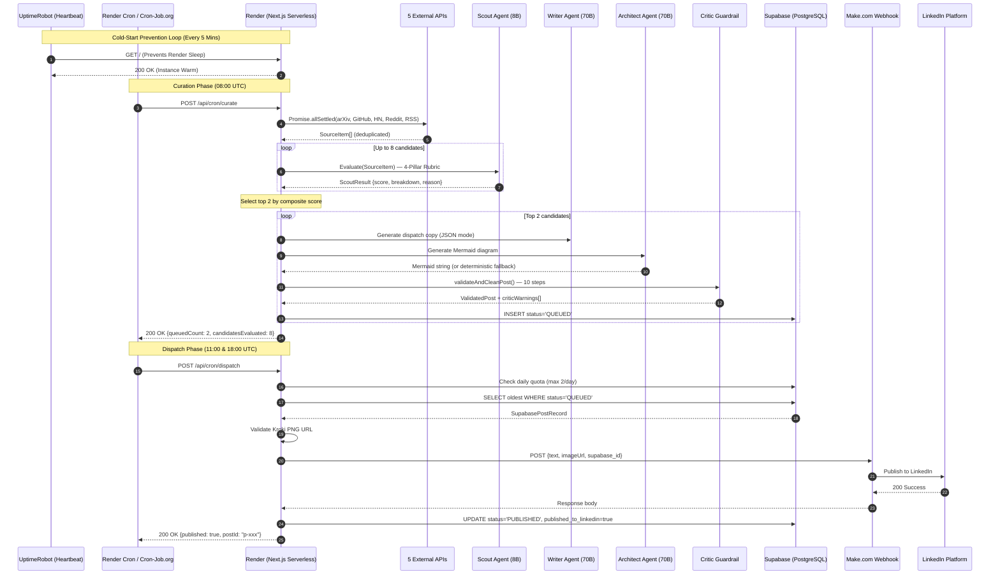

# ARINVOSS // Autonomous AI Publishing Engine

[](https://arinvoss.onrender.com/)
[](https://groq.com/)
[](https://supabase.com/)
[](https://nextjs.org/)
[](https://www.linkedin.com/company/aris-voss/)

---

## Executive System Overview

**ARINVOSS** is an enterprise-grade, fully autonomous AI research intelligence and content synthesis platform. Operating as a headless, stateful multi-agent system, Arinvoss continuously ingests bleeding-edge scientific papers from arXiv, open-source repositories from GitHub, technical disclosures from Hacker News, community research from Reddit, and lab publications from OpenAI, Anthropic, DeepMind, Hugging Face, BAIR, and Mistral — filtering low-signal noise through a **4-pillar 100-point Evaluator-Optimizer agentic loop**, and orchestrates multi-channel distribution to LinkedIn completely hands-free.

The system produces exactly **2 high-signal technical dispatches per UTC day**, each passing through a 4-agent directed pipeline with deterministic verification, automated Mermaid.js architecture diagram synthesis, and a 10-step Critic Guardrail validation matrix before autonomous webhook dispatch.

### Live System Terminals

* **Production Dashboard:** [arinvoss.onrender.com](https://arinvoss.onrender.com/)
* **Automated Publication Channel:** [Aris Voss — LinkedIn Company Page](https://www.linkedin.com/company/aris-voss/)

---

## Design Philosophy & UX Paradigm

The Arinvoss dashboard and administrative interfaces were engineered using dedicated **design specification documents** (`nikedesign.md` and Apple Industrial UI references) that codified the following principles before a single component was built:

* **Stark Spatial Hierarchy (Apple Industrial Minimalism):** Intentional negative space, aggressive contrast ratios, and typography-first layouts to prioritize real-time cognitive clarity. Every data-dense element — from the enterprise data table to the editorial rationale drawers — follows a strict information density gradient that eliminates visual competition.

* **Zero-Latency Visual Feedback (Nike Kinetic Design):** Micro-animations, stagger-loaded card transitions, and real-time state synchronization reflecting agent reasoning steps without layout shifts. The `.fade-in` and `.stagger-N` CSS animation classes were derived directly from Nike's high-contrast motion language.

* **Monochromatic Functional Aesthetics:** Industrial gray-scale palettes (`--bg-primary: #0a0a0f`, `--surface: #12121a`) with targeted high-visibility state indicators — active execution green (`#10b981`) for published posts, evaluator rejection amber (`#fbbf24`) for queued items, and crimson (`#f87171`) for daily quota saturation.

* **Dual-Mode Data Visualization:** Users switch between an **Enterprise Data Table** (spreadsheet-grade density with inline score capsules, source pills, and metric badges) and a **Card Stream** (social-media-native full-post preview with embedded Mermaid architecture diagrams, expandable editorial rationale drawers, and verified source banners).

---

## System Architecture & Multi-Agent Topology

Arinvoss replaces linear script execution with a **Stateful Directed Acyclic Graph (DAG)** powered by 4 specialized, autonomous LLM agents acting in concert through a deterministic orchestration pipeline.

```text
                  ┌─────────────────────────────────────────┐
                  │     Render Cron Trigger (08:00 UTC)      │
                  └────────────────────┬────────────────────┘
                                       │
                  ┌────────────────────▼────────────────────┐
                  │   5-Source Parallel Ingestion Layer      │
                  │  ┌───────┬────────┬───────┬──────────┐  │
                  │  │ arXiv │ GitHub │  HN   │ Reddit   │  │
                  │  └───┬───┴────┬───┴───┬───┴────┬─────┘  │
                  │      │  RSS/Atom Feeds (6 Labs) │        │
                  │      └────────┬────────────────┘        │
                  └───────────────┬─────────────────────────┘
                                  │ Promise.allSettled()
                                  ▼
┌─────────────────────────────────────────────────────────────────────────────┐
│                  AGENT 1: SCOUT — Research Evaluator                         │
│  Model: llama-3.1-8b-instant | Temp: 0.3 | Enforced JSON Mode               │
│  ─────────────────────────────────────────────────────────────────────────── │
│  4-Pillar 100-Point Quantitative Rubric:                                     │
│    • AI Relevance        (0–25)  — Strictly AI/LLMs/ML systems              │
│    • Technical Novelty   (0–25)  — Architectural breakthrough evidence      │
│    • Scroll-Stopping     (0–30)  — Practitioner explainability score        │
│    • Source Credibility  (0–20)  — arXiv, HF, starred GitHub, lab blog      │
│                                                                              │
│  Publication Gate: Score ≥ 75 AND ai_relevance ≥ 15 AND scroll_stop ≥ 18   │
└──────────────────────────────────────┬──────────────────────────────────────┘
                    │                                     │
           [Score < 75]                          [Score ≥ 75]
                    │                                     │
                    ▼                                     ▼
      ┌───────────────────────────┐    ┌──────────────────────────────────────┐
      │ rejected_topics table     │    │      Top 2 Candidates Selected       │
      │ (21-day cooldown before   │    └──────────────────┬───────────────────┘
      │  re-evaluation eligible)  │                       │
      └───────────────────────────┘                       ▼
┌─────────────────────────────────────────────────────────────────────────────┐
│                  AGENT 2: WRITER — Content Synthesizer                       │
│  Model: llama-3.3-70b-versatile | Temp: 0.7 | Enforced JSON Mode            │
│  ─────────────────────────────────────────────────────────────────────────── │
│  Locked Dispatch Template:                                                   │
│    1. Opening Hook (engineering bottleneck, 1–2 punchy lines)               │
│    2. Core Mechanism Explanation (2 conversational sentences)                │
│    3. Exactly 3 Key Takeaways (Performance → Architecture → Impact)         │
│    4. Practical CTA: "If you are building [domain]..."                      │
│    5. Verified Source URL                                                    │
│    6. Exactly 6 topic-tailored viral hashtags                               │
│                                                                              │
│  Intellectual Continuity: Receives digest of 5 most recent publications     │
│  to prevent topic repetition and maintain editorial variety.                │
└──────────────────────────────────────┬──────────────────────────────────────┘
                                       │
                                       ▼
┌─────────────────────────────────────────────────────────────────────────────┐
│                  AGENT 3: ARCHITECT — Diagram Synthesizer                    │
│  Model: llama-3.3-70b-versatile | Temp: 0.2 | Raw Mermaid Output            │
│  ─────────────────────────────────────────────────────────────────────────── │
│  Generates 6–15 node research-grade Mermaid.js architecture flowcharts.     │
│  Deterministic Fallback: If LLM fails, synthesizeDeterministicDiagram()     │
│  classifies topic via regex (Agent/Kernel/Benchmark/LLM/Generic) and        │
│  generates domain-appropriate diagram. 100% diagram coverage guaranteed.    │
│                                                                              │
│  Diagram → Kroki.io PNG: zlib.deflateSync → base64url → direct PNG URL     │
└──────────────────────────────────────┬──────────────────────────────────────┘
                                       │
                                       ▼
┌─────────────────────────────────────────────────────────────────────────────┐
│              AGENT 4: CRITIC — Deterministic Verification Matrix             │
│  Type: Pure rule engine (zero LLM calls — deterministic validation)          │
│  ─────────────────────────────────────────────────────────────────────────── │
│  10-Step Verification Pipeline:                                              │
│    1. Banned buzzword scrubbing (12 regex patterns)                         │
│    2. Inline Mermaid code stripping from prose                              │
│    3. Existing hashtag extraction & normalization                           │
│    4. Paragraph whitespace enforcement (double line breaks)                 │
│    5. Source CTA footer injection (if missing)                              │
│    6. Complete markdown asterisk removal (**, *, ***)                       │
│    7. Topic tag validation & fallback defaults                              │
│    8. Exactly 6 high-engagement hashtag enforcement                         │
│    9. Mermaid diagram syntax validation + deterministic fallback            │
│   10. Metrics cited deduplication & sanitization (max 4)                    │
│                                                                              │
│  NO payload reaches Supabase or the webhook without passing all 10 steps.   │
└──────────────────────────────────────┬──────────────────────────────────────┘
                                       │
                                       ▼
                          ┌───────────────────────────┐
                          │  Supabase: status=QUEUED   │
                          └─────────────┬─────────────┘
                                        │
                  ┌─────────────────────▼─────────────────────┐
                  │  Render Cron Trigger (11:00 & 18:00 UTC)   │
                  └─────────────────────┬─────────────────────┘
                                        │
                                        ▼
┌─────────────────────────────────────────────────────────────────────────────┐
│                  DISPATCH ENGINE — Autonomous LinkedIn Publisher              │
│  ─────────────────────────────────────────────────────────────────────────── │
│  1. Daily Quota Check: Enforces hard ceiling of 2 posts per UTC day         │
│  2. Queue Pop: SELECT oldest WHERE status = 'QUEUED' ORDER BY created_at    │
│  3. PNG Validation: Verifies Kroki image URL or regenerates from diagram    │
│  4. Webhook POST: { text, imageUrl, supabase_id } → Make.com               │
│  5. State Transition: UPDATE status = 'PUBLISHED', published_to_linkedin   │
│  6. Auto-Curation: If queue empty, triggers runCurationCycle() inline       │
└──────────────────────────────────────┬──────────────────────────────────────┘
                                       │
                                       ▼
                          ┌───────────────────────────┐
                          │  LinkedIn Live Publication │
                          └───────────────────────────┘
```
### Human-in-the-Loop (HITL) Override & Editorial Sovereignty
While ARINVOSS is fully autonomous, it features a master **Editorial Override Protocol**. In the event that a human administrator identifies a breakthrough research paper that the Scout Agent incorrectly rejected (or scored below the 75-point threshold), the dashboard provides a one-click **"Force Queue"** mechanism. 
This bypasses the Scout's rejection lock, forcefully promotes the topic into the Writer Agent's pipeline, and seamlessly integrates it back into the autonomous dispatch queue—ensuring the system remains completely hands-free while preserving absolute human editorial sovereignty.

---

## State Machine & Post Lifecycle

Every post transitions through a rigorous **Finite State Machine** persisted in Supabase PostgreSQL:

```text
┌──────────┐     Curation Engine      ┌───────────┐     Dispatch Engine     ┌─────────────┐
│  DRAFT   │ ───────────────────────→ │  QUEUED   │ ─────────────────────→ │  PUBLISHED  │
└──────────┘   Scout + Writer +       └───────────┘   Webhook dispatch +   └─────────────┘
                Architect + Critic                     Supabase UPDATE
```

| Transition | Trigger | Validation |
|:---|:---|:---|
| `DRAFT → QUEUED` | Curation Cron (08:00 UTC) | Scout score ≥ 75, ai_relevance ≥ 15, scroll_stopping ≥ 18 |
| `QUEUED → PUBLISHED` | Dispatch Cron (11:00 / 18:00 UTC) | Daily quota < 2, valid PNG URL, webhook 200 OK |

---

## Complete End-to-End Sequence Diagram



---

## Database Architecture & State Management

Arinvoss maintains absolute transactional state using **Supabase PostgreSQL** with Row Level Security, ensuring zero duplicate publications and full auditability across all pipeline stages.

| Table | Primary Role | Key Columns | Lifecycle State |
|:---|:---|:---|:---|
| `posts` | State Machine Ledger | `id`, `status`, `text`, `rationale`, `editorial_score`, `mermaid_diagram`, `image_url`, `metrics_cited`, `sources`, `topic_tags`, `published_to_linkedin`, `linkedin_published_at`, `webhook_response` | `DRAFT` → `QUEUED` → `PUBLISHED` |
| `rejected_topics` | Failure Diagnostics & Audit Trail | `id`, `agent_id`, `topic`, `reason`, `source_url`, `created_at` | Rejected by Scout (21-day cooldown) |
| `backlog` | Dynamic Arbitration Queue | `id`, `agent_id`, `title`, `url` (UNIQUE), `score`, `breakdown`, `reason`, `source_name`, `readme_snippet` | Runner-up candidates for future cycles |

**Indexes:** `idx_posts_status`, `idx_posts_created_at` (DESC), `idx_posts_agent_id`

**Row Level Security:** All tables have RLS enabled with public SELECT policies (for dashboard reads) and service-role full-access policies (for agent writes).

### URL Deduplication Engine

* **Canonicalization:** Strips hash fragments, UTM parameters (`utm_source`, `utm_medium`, `utm_campaign`, `ref`), and trailing slashes
* **Fingerprinting:** `base64url(canonicalized_url).substring(0, 40)` — deterministic 40-character collision-resistant key
* **Published URLs:** Permanently blocked from re-evaluation
* **Rejected URLs:** 21-day cooldown before re-evaluation eligibility

---

## Infrastructure Topology & Cold-Start Resilience

To maintain 100% availability on Render's containerized infrastructure, Arinvoss utilizes a **dual-engine external orchestration protocol** combining heartbeat monitoring with autonomous cron scheduling:

```text
+────────────────────────────────────────────────────────────────────────────+
│                          ARINVOSS INFRASTRUCTURE                          │
│                                                                           │
│  ┌─────────────────────┐    Heartbeat Ping     ┌───────────────────────┐  │
│  │    UptimeRobot       │ ──────────────────→  │    Render Web Server  │  │
│  │  (5-Min GET Pings)   │   Prevents Sleep     │  (Next.js 16 + API)  │  │
│  └─────────────────────┘                       └──────────┬────────────┘  │
│                                                           │               │
│  ┌─────────────────────┐    HTTP POST Triggers            │               │
│  │  Render Native Cron  │ ────────────────────────────────┘               │
│  │  + Cron-Job.org      │   Executes Curate/Dispatch                     │
│  │  (08:00, 11:00,      │                                                │
│  │   18:00 UTC)          │                                                │
│  └─────────────────────┘                                                  │
│                                                                           │
│  ┌─────────────────────┐                       ┌───────────────────────┐  │
│  │    Supabase          │ ←──────────────────→ │    Make.com Webhook   │  │
│  │  (PostgreSQL + RLS)  │   State Persistence  │  → LinkedIn API      │  │
│  └─────────────────────┘                       └───────────────────────┘  │
│                                                                           │
│  ┌─────────────────────┐                       ┌───────────────────────┐  │
│  │    Groq Cloud        │                      │    Kroki.io           │  │
│  │  (Llama 3 Inference) │                      │  (Mermaid → PNG)     │  │
│  └─────────────────────┘                       └───────────────────────┘  │
+────────────────────────────────────────────────────────────────────────────+
```

### 1. Zero-Latency Warmup Protocol (UptimeRobot)

* **Frequency:** 5-minute ping intervals (`HTTP GET https://arinvoss.onrender.com`)
* **Purpose:** Render free instances spin down after 15 minutes of inactivity. The 5-minute heartbeat guarantees zero cold-start latency when scheduled cron triggers fire.
* **Resource Impact:** ~288 requests/day — well within Render's free-tier runtime allowance.

### 2. Autonomous Trigger System (Render Cron + Cron-Job.org)

The system uses **Render's native cron jobs** (defined in `render.yaml`) as the primary scheduler, with **Cron-Job.org** as a redundant external fallback:

| Cron Task | Time (IST) | Time (UTC) | Crontab Expression | Endpoint |
|:---|:---|:---|:---|:---|
| Curation | 01:30 PM | 08:00 AM | `0 8 * * *` | `POST /api/cron/curate` |
| Dispatch #1 | 04:30 PM | 11:00 AM | `0 11 * * *` | `POST /api/cron/dispatch` |
| Dispatch #2 | 11:30 PM | 06:00 PM | `0 18 * * *` | `POST /api/cron/dispatch` |

### 3. Background Worker Fallback (`scripts/worker.js`)

A standalone Node.js process that runs as a Render Background Worker, polling UTC hours every 60 seconds and firing cron endpoints at the correct windows. This serves as a triple-redundancy layer ensuring autonomous execution even if both Render Cron and Cron-Job.org experience outages.

---

## LLM Inference Engine & Rate-Limit Resilience

All LLM inference is routed through **Groq Cloud** for hardware-accelerated Llama 3 execution:

| Agent | Model | Temperature | Max Tokens | Response Format | Retry Strategy |
|:---|:---|:---|:---|:---|:---|
| Scout | `llama-3.1-8b-instant` | 0.3 | 350 | `json_object` | 5 retries, 6s + 2s/attempt backoff |
| Writer | `llama-3.3-70b-versatile` | 0.7 | 900 | `json_object` | 5 retries, 7s + 2s/attempt backoff |
| Architect | `llama-3.3-70b-versatile` | 0.2 | 1800 | Raw text | 3 retries, 7s + 2s/attempt backoff |

**Rate-Limit Detection:** HTTP 429 status code + string matching (`"429"`, `"rate_limit"`, `"Rate limit"`) with adaptive exponential backoff.

**Source Fault Isolation:** All 5 external source fetchers execute within `Promise.allSettled()` — any individual API failure (network timeout, rate limit, malformed XML) is isolated and never cascades to other sources. Each fetcher uses `AbortSignal.timeout()` (6–15 seconds).

---

## API Route Architecture

```text
/api
├── /agent
│   ├── /backlog          # GET  — Current queued research candidates
│   ├── /cycle            # POST — Manual single-cycle trigger (maxDuration: 180s)
│   ├── /feed             # GET  — Published posts (Supabase-first, local fallback)
│   ├── /init             # POST — Initialize agent persona (idempotent)
│   ├── /rejected         # GET  — Editorial rejection audit trail
│   ├── /reset            # POST — Flush queue and reset state machine
│   ├── /scheduler        # POST — Toggle autonomous interval scheduler
│   └── /supabase-sync    # GET/POST — Sync local store ↔ Supabase
└── /cron
    ├── /curate           # POST — Autonomous 5-source scraping + Scout + Writer + Critic pipeline
    └── /dispatch         # POST — Autonomous queue pop + webhook dispatch + state transition
```

### Dynamic Cross-Day Backlog Arbitration
To prevent "pipeline starvation" on days when the global AI research cycle is slow or dry, ARINVOSS maintains a highly intelligent **Historical Memory Backlog**. 
When the Scout Agent evaluates a batch of papers, any paper that scores highly (≥ 75) but loses to the #1 spot is not discarded. Instead, it is persisted to the Backlog. On subsequent days, the **Curation Engine** combines the fresh daily feed with the historical Backlog, sorting the entire combined pool by score. 
If today's best research scores a mediocre 78, but yesterday's runner-up scored a massive 92, the system will autonomously pull yesterday's runner-up and publish it today. This ensures that the overall quality of the LinkedIn feed never degrades, regardless of daily news volume.

---

## Source Ingestion Network

| Source | API | Coverage | Items/Cycle |
|:---|:---|:---|:---|
| **arXiv** | Atom API (`export.arxiv.org`) | cs.CL, cs.LG, cs.AI, cs.NE (+ cs.CV, cs.RO in expanded mode) | 20–60 |
| **GitHub** | Search API (`api.github.com`) | LLM agents, vLLM/quantization, VLMs, reasoning/RL | 20–40 + README scraping |
| **Hacker News** | Algolia API (`hn.algolia.com`) | AI + ML + LLM stories | 10 |
| **Reddit** | JSON API (`reddit.com`) | r/LocalLLaMA, r/MachineLearning, r/ArtificialIntelligence | 18 |
| **RSS/Atom** | Direct feed parsing | OpenAI, Anthropic, DeepMind, Hugging Face, BAIR, Mistral | 30 |
| **Continuity Pool** | Static fallback | 8 curated foundational papers (FlashAttention, vLLM, DPO, LoRA, RAG, QLoRA, InstructGPT, CoT) | 8 |

---

## Technology Stack

| Layer | Technology | Role |
|:---|:---|:---|
| **Frontend** | Next.js 16.3 (React 19, App Router) | Dashboard, Editorial Feed, Dual-Mode Views |
| **Backend** | Next.js API Routes (Serverless) | RESTful agent endpoints + cron triggers |
| **LLM Inference** | Groq Cloud (Llama 3.1 8B + Llama 3.3 70B) | Scout evaluation, Writer generation, Architect diagramming |
| **Database** | Supabase (PostgreSQL + PostgREST + RLS) | Single source of truth with state machine indexing |
| **Diagram Rendering** | Kroki.io (Mermaid → PNG via deflate + base64url) | Deterministic server-side architecture diagram generation |
| **Automation Bridge** | Make.com Webhook → LinkedIn API | Headless asynchronous webhook pipeline for social dispatch |
| **Hosting** | Render (Web Service + Native Cron Jobs) | Blueprint-defined infrastructure-as-code (`render.yaml`) |
| **Cold-Start Prevention** | UptimeRobot (5-min heartbeat pings) | Zero-latency warmup protocol for serverless containers |
| **Design System** | Custom CSS (Nike Kinetic + Apple Industrial specs) | Derived from `nikedesign.md` and Apple UI specification documents |

---

## Deployment & Local Development

### Prerequisites

* **Node.js:** v20.x or higher
* **Package Manager:** npm

### Environment Configuration

```env
NEXT_PUBLIC_SUPABASE_URL=https://<your-project>.supabase.co
NEXT_PUBLIC_SUPABASE_PUBLISHABLE_KEY=<your-supabase-key>
GROQ_API_KEY=<your-groq-api-key>
```

### Commands

```bash
# Install dependencies
npm install

# Run local development server
npm run dev

# Build production artifacts
npm run build

# Start production server
npm run start
```

### Render Deployment (via Blueprint)

The repository includes a `render.yaml` Blueprint file that auto-configures:
1. **Web Service** — `npm install && npm run build` → `npm start`
2. **Curation Cron** — `0 8 * * *` → `POST /api/cron/curate`
3. **Dispatch Cron** — `0 11,18 * * *` → `POST /api/cron/dispatch`

---

## Summary Specification Matrix

| Metric | Value |
|:---|:---|
| **Primary Engine** | Next.js 16 App Router (TypeScript) |
| **LLM Inference Speed** | ~280 tokens/sec via Groq hardware acceleration |
| **Agent Count** | 4 specialized agents (Scout, Writer, Architect, Critic) |
| **Source Coverage** | 5 live APIs + 6 lab RSS feeds + 8 continuity papers |
| **Daily Output** | Exactly 2 high-signal dispatches per UTC day |
| **Evaluation Rubric** | 100-point 4-pillar scoring with triple-gate threshold |
| **Verification Steps** | 10-step deterministic Critic Guardrail matrix |
| **Diagram Guarantee** | 100% coverage via LLM + deterministic fallback synthesis |
| **Fault Tolerance** | Exponential backoff retry, `Promise.allSettled` isolation, auto-curation on empty queue |
| **State Persistence** | Supabase PostgreSQL with RLS, indexed state machine, full audit trail |

---

## Hackathon Evaluation & Problem Statement Compliance Matrix

| Evaluation Criteria | Minimum Requirement | ARINVOSS Implementation | Verification Endpoint / Artifact | Status |
| :--- | :--- | :--- | :--- | :---: |
| **1. Topic Discovery** | Ingest AI/tech topics from live sources | 5 parallel live feeds: arXiv Atom API, GitHub Search & READMEs, Hacker News Algolia, Reddit (`r/LocalLLaMA`, `r/MachineLearning`), 6 AI Lab RSS feeds | `/api/cron/curate` | **VERIFIED** |
| **2. Editorial Judgment** | Intentionally reject unqualified topics with reasons | 100-Point 4-Pillar Rubric (Scout Agent). Requires score $\ge 75$, AI relevance $\ge 15/25$, and scroll-stopping $\ge 18/30$. Rejections logged to Supabase with gap diagnostics and 21-day cooldown | `/api/agent/rejected` | **VERIFIED** |
| **3. Consistent Persona** | Stable interests, distinct voice, recognizable style | **Aris Voss (AI Systems Research Engineer):** Anti-hype, architecture-focused, strictly plain-text (no markdown asterisks), 3-takeaway structure (Performance $\rightarrow$ Architecture $\rightarrow$ Impact), 6 viral hashtags | `/api/agent/feed` | **VERIFIED** |
| **4. Memory & Continuity** | Remember past posts, avoid repetition over 48h | Multi-tier persistence: Base64url URL fingerprinting, digest of last 5 posts fed to Writer, Supabase atomic state table | `supabase.ts` + `seen.json` | **VERIFIED** |
| **5. Autonomous 48-Hour Publishing** | Publish periodically without human prompts | Render Native Cron (`0 8 * * *` Curation, `0 11,18 * * *` Dispatch) + 5-min UptimeRobot keep-alive. Strictly 2 posts/day ceiling | `render.yaml` + `/api/cron/dispatch` | **VERIFIED** |
| **6. Publishing Rationale** | Return why selected, why relevant now, sources | Structured JSON rationale containing `whyTopicSelected`, `whyRelevantNow`, and verified `sources` array in every feed item | `GET /api/agent/feed?agentId=...` | **VERIFIED** |
| **7. Strict API Compliance** | `POST /api/agent/init` and `GET /api/agent/feed` | Idempotent agent initialization returning `agentId`; feed returning reverse chronological ISO 8601 UTC posts | `POST /api/agent/init`<br>`GET /api/agent/feed` | **VERIFIED** |

---

## Why ARINVOSS Outperforms Competitive Submissions

| Differentiator | Standard Hackathon Submission | ARINVOSS Autonomous Pipeline |
| :--- | :--- | :--- |
| **Live Production Deployment** | Localhost demo or static scripts | **Live on Render** with production URL ([arinvoss.onrender.com](https://arinvoss.onrender.com)) & live LinkedIn publication channel |
| **Architecture Diagram Engine** | Text-only posts or hallucinated images | **100% diagram coverage** via Mermaid.js + server-side Kroki PNG compilation with deterministic fallbacks |
| **Critic Guardrail Matrix** | Direct LLM output with formatting artifacts | **10-step post-generation validation** ensuring proper well formatted posts |
| **Multi-Tier State Machine** | Ephemeral in-memory array | **Supabase PostgreSQL** atomic state machine (`DRAFT` $\rightarrow$ `QUEUED` $\rightarrow$ `PUBLISHED`) with RLS & indexes |
| **Dual-Mode UI Dashboard** | Basic unstyled template | **Apple Industrial Minimalist + Nike Kinetic UI** with real-time Data Table and interactive Card Stream views |
| **Quality Degradation Prevention** | Fails to post if feeds are dry, or posts low-quality filler | **Dynamic Backlog Arbitration** pulls high-scoring runner-up topics from 1-3 days prior if today's live feed lacks high-signal research |
| **Editorial Sovereignty** | Hard-coded AI decisions; no way to override rejections | **Human-in-the-Loop (HITL) Dashboard Override** allows admins to forcefully promote and queue rejected papers with a single click |


---

<p align="center">
  <strong>ARINVOSS</strong> — Zero-intervention AI research intelligence.<br/>
  Built for autonomous execution. Engineered for signal density.
</p>


